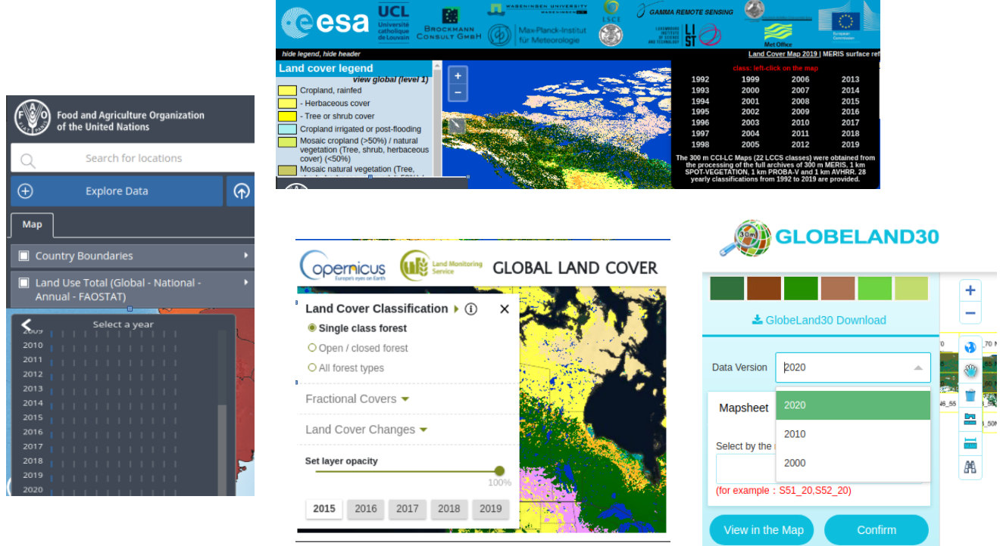
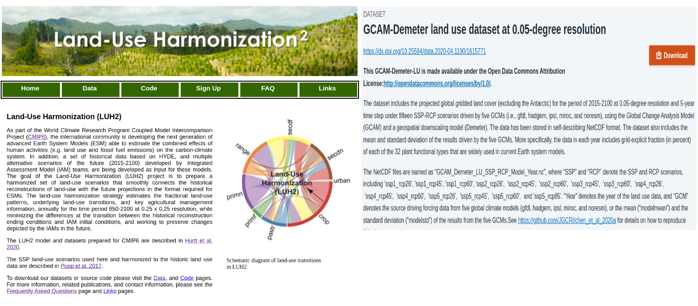
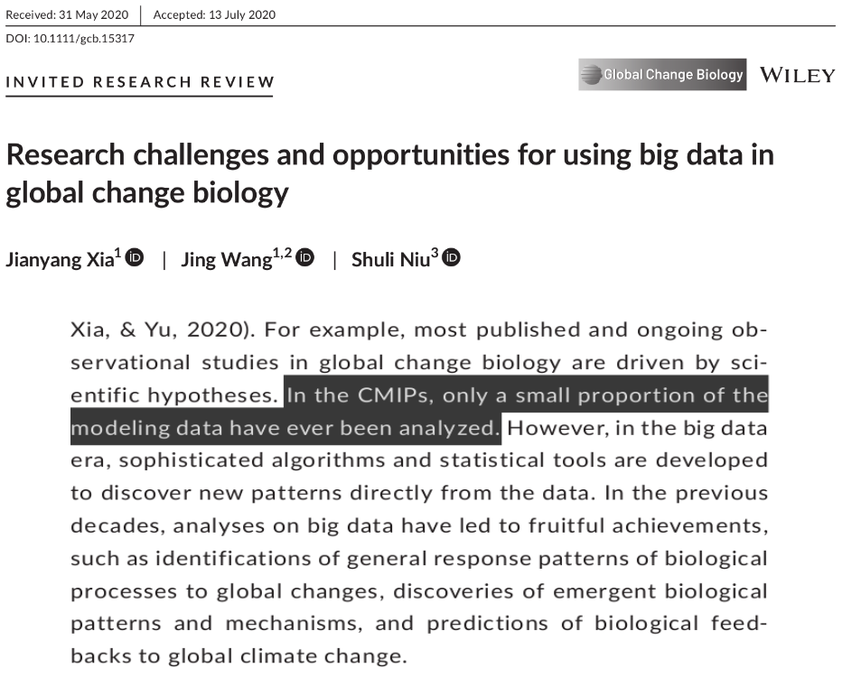
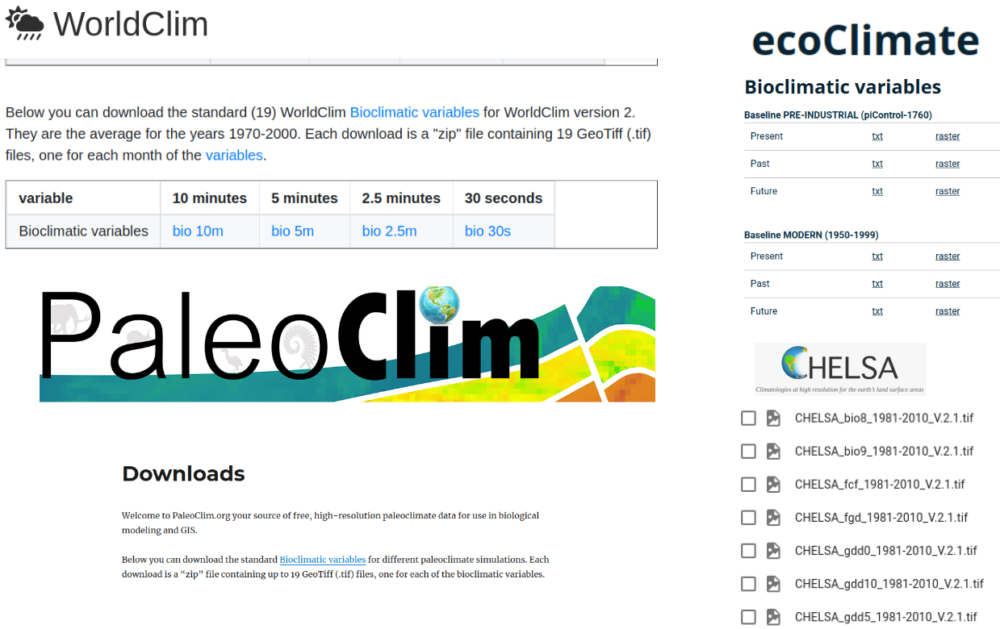
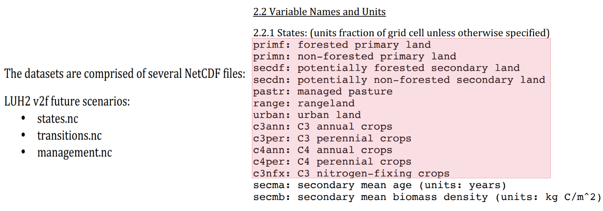
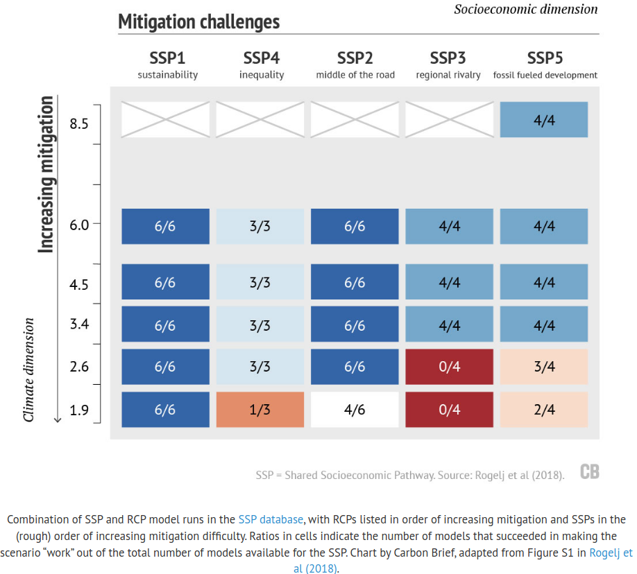
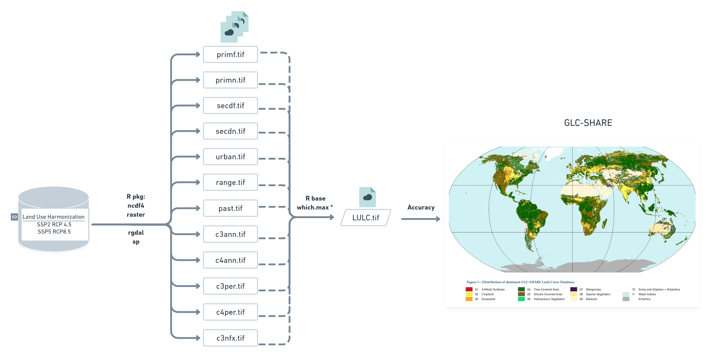
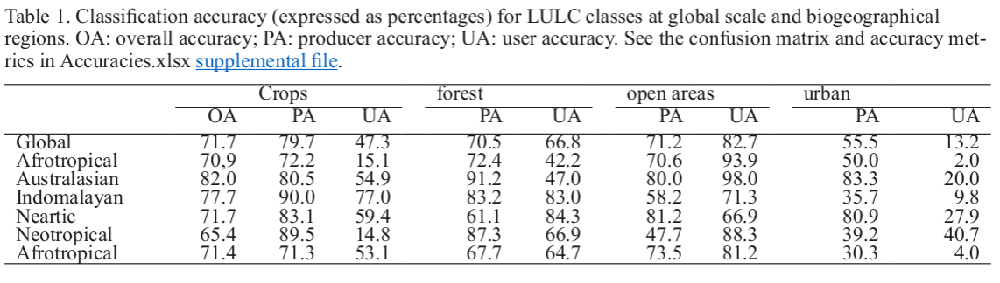
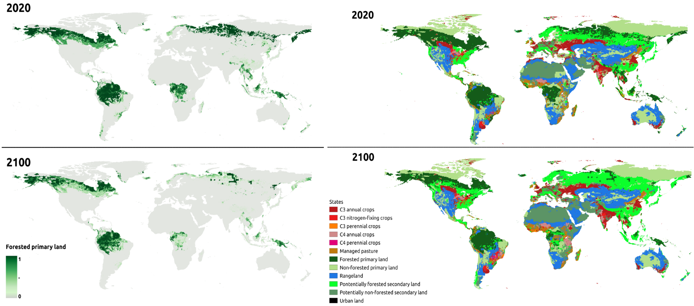
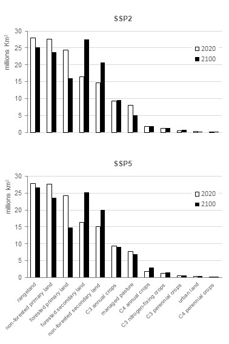

```{r setup, include=FALSE}
`%>%` <- magrittr::`%>%`

colorido <- function(x, cor = "#6495ed") {
  glue::glue(
    '<span style="color:{cor}; font-weight: bold;">{x}</span>'
  ) %>% 
    htmltools::HTML()
}

options(width = 85)

knitr::opts_chunk$set(eval = TRUE, echo = TRUE, comment = "#>", fig.align = "center")
```

About me 👩‍🎓
 - [Biologist](#academic_1) [UFPA](https://portal.ufpa.br/) 
 - [MSc. Environmental biology](academic_2) [IECOS](https://www.museu-goeldi.br/)
 - [PhD Zoology](academic_3) [MPEG](https://www.museu-goeldi.br/)

--
<br>
<br>
<br>
<br>

## Biodiversity distribution patterns

---
.right-column[
```{r echo=FALSE, fig.align='right', out.width="60%"}
knitr::include_graphics(rep("img/spatia_ana_2.png"))
```
]

About me 👩‍🎓
 - [Biologist](#academic_1) [UFPA](https://portal.ufpa.br/) 
 - [MSc. Environmental biology](academic_2) [IECOS](https://www.museu-goeldi.br/)
 - [PhD Zoology](academic_3) [MPEG](https://www.museu-goeldi.br/)

### Biodiversity distribution patterns

### Spatial analasyis of biodivesity and global changes

> Ecological Niche Models 

> Climate data

> Land-use and land-cover data📌

---
class: center

name: sumario

## Land-use land-cover (LULC)
```{r echo=FALSE, fig.align='center', out.width="70%"}
knitr::include_graphics(rep("img/paper.png"))
```
<br>
<br>
 Motivation <br>
 Goals <br>
 Methods <br>
 Results/ Main findings  <br>
 Limitation <br>
 Conclusion


---
## Motivation
## Land-use land-cover

- Important predictor of anthropogenic impacts and biodiversity threats (Gomes et al. 2020, 2021; Rosa et al. 2021).

- One of the main drivers of environmental change at multiple scales (Gomes et al. 2020, 2021; Rosa et al. 2021).
--

- Ecosystem services ( InVEST modeling tool, Sharp et al.2020).📌

- Ecological niche models, as predictor or pos processing analysis. 📌 (Eyringet al. 2016; Ruiz-Benito et al.
2020; Sobral-Souza et al. 2021)


--

## Thus...

Mapping land-use land-cover (LULC) changes through time is important and desirable for different purposes studies (Mantyka-Pringle et al. 2015; Titeux et al. 2017; Newbold 2018; Clerici et al. 2019; Hong et al. 2019; Jetz et al 2007; Powers and Jetz 2019).

---
## Motivation
##### There are many LULC products.
```{r echo=FALSE, fig.align='center', out.width="80%"}

```


---
## Motivation 
##### Today, we have two initiatives that provide a large time-series for Land-use.
--

```{r echo=FALSE, fig.align='center', out.width="85%"}

```
LUH is part of CMIP, primary source in the reports of the Intergovernmental Panel on Climate Change (IPCC)

---

## Motivation 
```{r echo=FALSE, fig.align='center', out.width="50%"}

```
--

### Besides, the format in which these data are available (NetCDF) seems to discourage their use.

---
## Motivation 
```{r echo=FALSE, fig.align='center', out.width="70%"}

```

- .tif or .asc format is usually required as input for ecology and biogeography analysis.
---
## Goals

- Make the LUH2 more accessible and in the format required for ecology and biogeography analysis.  

- Derive a new categorical data (LULC) from LUH2 (Land-use)

```{r echo=FALSE, fig.align='center', out.width="75%"}
knitr::include_graphics(rep("img/paper.png"))
```

---

## Methods

[Land-Use Harmonization (LUH2)- CMIP6](https://luh.umd.edu/data.shtml)

```{r echo=FALSE, fig.align='center', out.width="65%"}

```
- “primary” refers to intact land, undisturbed by human activities since 850.

- “secondary” refers to land undergoing a transition or recovering from previous human activities (Hurrt et al. 2006; 2011; 2020).

- “forested” and “non-forested” are based on the aboveground standing stock of natural cover (> 2 kg/cm-²).
---

### Methods
[CMIP6 Scenarios: Shared Socioeconomic Paths (SSP) and  Representative Concentration Pathway (RCP)](https://www.carbonbrief.org/explainer-how-shared-socioeconomic-pathways-explore-future-climate-change)

```{r echo=FALSE, fig.align='center', out.width="54%"}

```
---
## Methods

```{r echo=FALSE, fig.align='center', out.width="90%"}

```


---
## Results/ Main findings

- States-files: LUH2 original data (continuous data) from years 850 to 2100 transformed into .tif format (16.056 files).

- LULC-files: the new categorical data created by combining the 12 States-files, also from 850 to 2100 transformed into .tif format (1.338 files)
<br>
<br>
--

```{r echo=FALSE, fig.align='center', out.width="90%"}

```
---
##  Results/ Main findings
##### SSP5 RCP8.5

```{r echo=FALSE, fig.align='center', out.width="100%"}

```
---
## Results/ Main findings
.right-colomun[
No quantitative difference between two scenarios
]
.left-colomun[
```{r echo=FALSE, fig.align='center', out.width="32%"}

```
]
---
##  Results/ Main findings

- Primary forest decrease :habitat loss and asso ciated biodiversity decline, specially of rarer species (Chase et al. 2020; Horta and Santos 2020; Lima et al.2020)

- Others researched reach similar findings (Svensson et al. 2019, Shapiro et al. 2021)
--

- Brazil: recent governmental actions have promoted deforestation and forest fires (Escobar 2019; 2020; Amigo 2020; Silva et al. 2021; França et al. 2021; Qin et al. 2021; Vale et al. 2021), with record deforestation rates in the Amazon (Junior al. 2021).

---
## Limitation

- The resolution

- Greenland

---
## Conclusion

- Forest loss for both scnarios (Fig.4, SSP2-4.5 and SSP5-8.5)

- Conversion from ______ to ______________

--

- The continuous data in the state-files may be particularly useful as predictors in ecological niche modeling (Peterson et al. 2011) or can be combined to species distribution models to reconstruct changes in species distributions (Sofaer et al. 2019; Cazaca et al.2020). It allows for the use of land cover data in projections of species distribution under future climate change scenarios.

- LULC-files can be useful in ecosystem services mapping (Invest), in studies of global change impacts from other perspectives and can help decision-makers in the construction of evidence based mitigation and conservation policies.

---

class: center
# Thanks !

```{r echo=FALSE, fig.align='center', out.width="32%"}

```
<br>
<br>
<br>
<br>
<br>
<br>

Reproduclible slides made with the R packages [xaringan](https://github.com/yihui/xaringan) and [xaringanthemer](https://github.com/gadenbuie/xaringanthemer). Code available at [Github](https://github.com/Tai-Rocha/LULC_paper_presentation.github.io)
