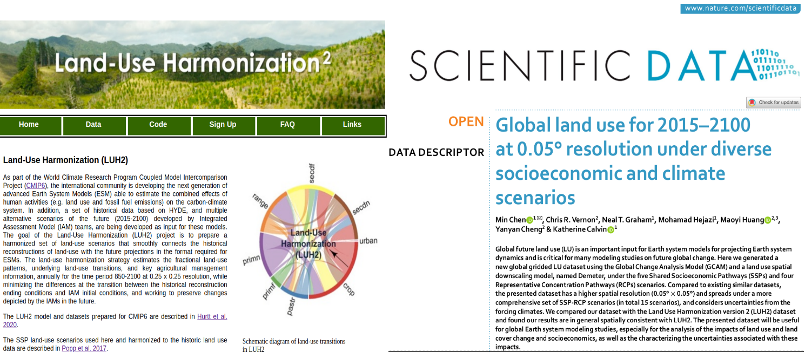
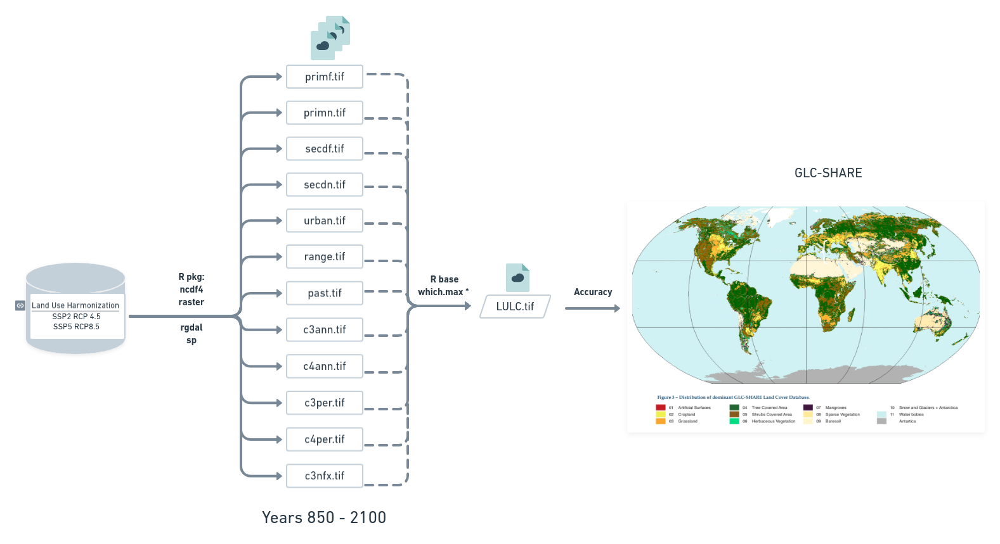

```{r setup, include=FALSE}
`%>%` <- magrittr::`%>%`

colorido <- function(x, cor = "#6495ed") {
  glue::glue(
    '<span style="color:{cor}; font-weight: bold;">{x}</span>'
  ) %>% 
    htmltools::HTML()
}

options(width = 85)

knitr::opts_chunk$set(eval = TRUE, echo = TRUE, comment = "#>", fig.align = "center")
```

About me 👩‍🎓
 - [Biologist](#academic_1) [UFPA](https://portal.ufpa.br/) 
 - [MSc. Environmental biology](academic_2) [IECOS](https://www.museu-goeldi.br/)
 - [PhD Zoology](academic_3) [MPEG](https://www.museu-goeldi.br/)

--
<br>
<br>
<br>
<br>

## Biodiversity distribution patterns

---
.right-column[
```{r echo=FALSE, fig.align='right', out.width="60%"}
knitr::include_graphics(rep("img/spatia_ana_2.png"))
```
]

About me 👩‍🎓
 - [Biologist](#academic_1) [UFPA](https://portal.ufpa.br/) 
 - [MSc. Environmental biology](academic_2) [IECOS](https://www.museu-goeldi.br/)
 - [PhD Zoology](academic_3) [MPEG](https://www.museu-goeldi.br/)

### Biodiversity distribution patterns

### Spatial analasyis of biodivesity and global changes

> Ecological Niche Models 

> Climate data

> Land-use and land-cover data📌

---
class: center

name: sumario

## Land-use land-cover (LULC)
```{r echo=FALSE, fig.align='center', out.width="70%"}
knitr::include_graphics(rep("img/paper.png"))
```
<br>
<br>
 Motivation <br>
 Goals <br>
 Methods <br>
 Main results (and limitation) <br>
 Conclusion


---
## Motivation
## Land-use land-cover

- Important predictor of anthropogenic impacts and biodiversity threats (Gomes et al. 2020, 2021; Rosa et al. 2021).

- One of the main drivers of environmental change at multiple scales (Gomes et al. 2020, 2021; Rosa et al. 2021).
--

- Ecological niche models, as predictor or pos processing analysis. 📌 (Eyringet al. 2016; Ruiz-Benito et al.
2020; Sobral-Souza et al. 2021)

- Ecosystem services as InVEST modeling tool (Sharp et al.2020).📌

--

## Thus...

Mapping land-use land-cover (LULC) changes through time is important and desirable for different purposes studies (Mantyka-Pringle et al. 2015; Titeux et al. 2017; Newbold 2018; Clerici et al. 2019; Hong et al. 2019; Jetz et al 2007; Powers and Jetz 2019).

---
## Motivation
##### There are many LULC products.
```{r echo=FALSE, fig.align='center', out.width="80%"}

```


---
## Motivation 
##### But there are few products of time series that cover historical and future. 
--
```{r echo=FALSE, fig.align='center', out.width="90%"}

```
--
Besides, the format in which these few data are available (NetCDF) seems to discourage their use.

---

## Motivation 
```{r echo=FALSE, fig.align='center', out.width="50%"}

```
---
## Motivation 
```{r echo=FALSE, fig.align='center', out.width="70%"}

```

- .tif or .asc format is usually required as input for ecology and biogeography analysis.
---
## Goal

- Make the LUH2 more accessible and in the format required for ecology and biogeography analysis.  

- Derive a new categorical data (LULC) from LUH2 (Land-use)*

---

## Methods

Land-Use Harmonization (LUH2)

```{r echo=FALSE, fig.align='center', out.width="50%"}
knitr::include_graphics("img/Lu_states.png")
```
- Forested and non-

- Secondary and 

---

## Methods
```{r echo=FALSE, fig.align='center', out.width="100%"}

```
---
## Main results

- States-files: LUH2 original (continuous data) from 850 to 2100 transformed into .tif format (16.056 files).

- LULC-files: the new categorical data created by combining the 12 States-files, also from 850 to 2100 transformed into .tif format (1.338 files)
<br>
<br>

```{r echo=FALSE, fig.align='center', out.width="70%"}

```

---
## Main results

```{r echo=FALSE, fig.align='center', out.width="100%"}

```


---
## Main results
.right-colomun[
No quantitative difference between two scenarios
]
.left-colomun[
```{r echo=FALSE, fig.align='center', out.width="32%"}
knitr::include_graphics("img/Fig4.jpg")
```
]
---
## Limitation

- The resolution

- Greenland

- Poor accuracy for some categories

---
## Conclusion

- Forest loss for both scnarios (Fig.4, SSP2-4.5 and SSP5-8.5)

- Conversion from ______ to ______________

--

- The continuous data in the state-files may be particularly useful as predictors in ecological niche modeling (Peterson et al. 2011) or can be combined to species distribution models to reconstruct changes in species distributions (Sofaer et al. 2019; Cazaca et al.2020). It allows for the use of land cover data in projections of species distribution under future climate change scenarios.

- LULC-files can be useful in ecosystem services mapping (Invest), in studies of global change impacts from other perspectives and can help decision-makers in the construction of evidence based mitigation and conservation policies.

---

class: center
# Thanks !

```{r echo=FALSE, fig.align='center', out.width="32%"}

```
<br>
<br>
<br>
<br>
<br>
<br>

Reproduclible slides made with the R packages [xaringan](https://github.com/yihui/xaringan) and [xaringanthemer](https://github.com/gadenbuie/xaringanthemer). Code available at [Github](https://github.com/Tai-Rocha/LULC_paper_presentation.github.io)
